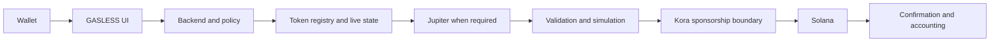

# Architecture

GASLESS separates the untrusted browser from a server-authoritative construction, policy, and sponsorship layer.

## Solana-native path

For CLEAN, SWAP, and SEND, the server builds the exact transaction and the user authorizes the asset action before Kora adds the payer signature. A materially changed transaction requires a new user authorization.

## Solana-origin cross-chain path

```mermaid
flowchart LR
  W[Wallet] --> U[GASLESS UI]
  U --> B[Backend and policy]
  B --> R[Token registry and route policy]
  R --> Q[Relay and Jupiter route construction]
  Q --> V[Cross-chain validation]
  V --> K[GASLESS and Kora sponsor Solana origin]
  K --> E[Relay execution]
  E --> D[Robinhood Chain destination]
  D --> C[Status and reconciliation]
```

The current Relay transaction arrives with the GASLESS payer role and is validated before Kora adds the payer signature. The wallet then signs the unchanged sponsored message. GASLESS final-simulates and broadcasts the same fully signed bytes on Solana, tracks Relay/onchain status, and reconciles delivery.

Provider roles are intentionally narrow: Helius supplies Solana state and RPC services, Jupiter supplies supported routes and pricing where applicable, Relay coordinates the cross-chain route, Kora independently constrains payer signing, Supabase stores durable accounting, Redis/Upstash provides short-lived locks and budgets, and Sentry receives redacted operational failures.

Chain-specific code lives under `chains/`, browser code under `src/`, private-capability server code under `server/`, and chain-neutral types under `shared/`. Credentials, signer identities, private endpoints, deployment topology, and operator procedures are outside this public snapshot.
