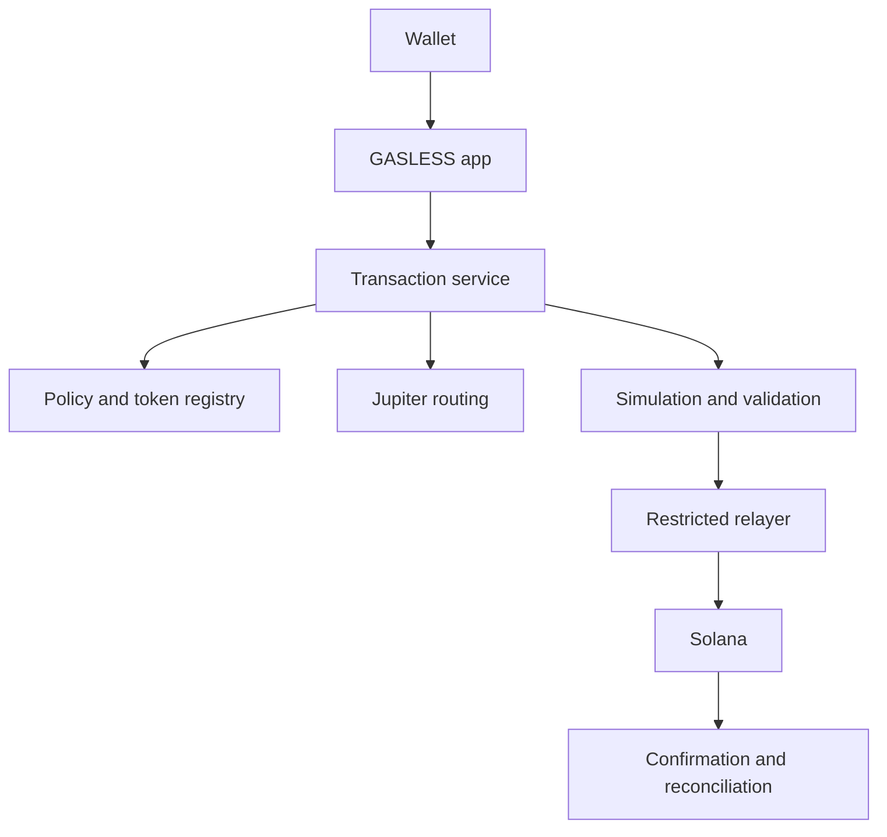

# Architecture

GASLESS separates an untrusted browser from a server-authoritative transaction and policy layer.

The frontend displays intent and outcomes and requests the wallet's signature. The backend loads authoritative state, selects eligible tokens and routes, builds the transaction, stores a short-lived quote, validates wallet-returned semantics, coordinates the restricted relayer, submits identical signed bytes, and reconciles durable records.

Chain-specific Solana builders live under `chains/solana/`. Browser code lives under `src/`, private-capability server code under `server/`, and chain-neutral transaction types under `shared/`.

Production operator controls, signer policy, credentials, pilot access, and deployment topology are deliberately outside this public source snapshot.
